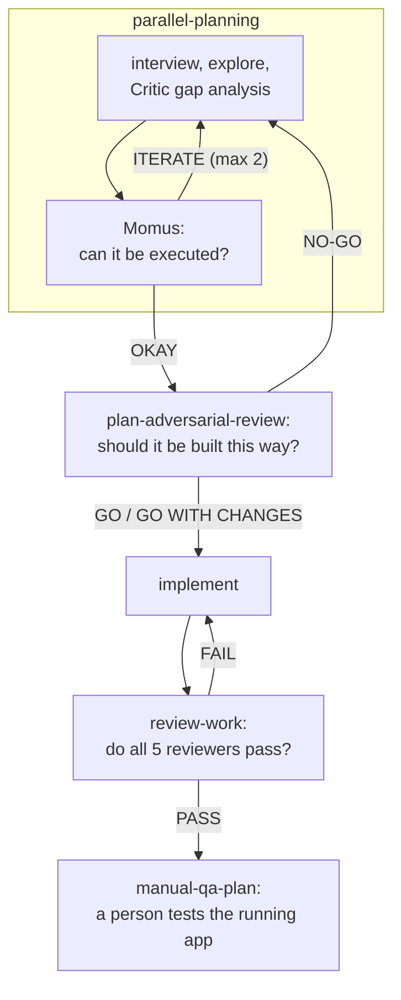

# Skills

A personal collection of **agent skills** — reusable, prompt-level workflows that an AI coding agent loads on demand instead of improvising.

Each skill is a directory whose entry point is `SKILL.md`. There is no build step and no runtime: the agent reads that file and follows it. Most skills stop there. Where one needs more than fits in a single readable file it splits — `references/` for detail loaded only at the step that needs it, `assets/` for templates the agent copies, `scripts/` for the one job better done deterministically than by prompt. `manual-qa-plan` is currently the only skill here with that structure.

Most of them describe an *orchestration* — which sub-agents to spawn, what each one is told, how their output is schema-constrained, and how the results get merged into one verdict or one plan. These lean hard on **parallel, adversarial, multi-agent structure**: several independent reviewers instead of one, hostile framing instead of polite framing, structured output instead of prose. That is the thesis behind them — one agent reviewing its own work rationalizes; three blind agents attacking from orthogonal angles do not.

The rest are single-pass discipline: no sub-agents, just a tight instruction set that constrains how the agent answers.

Primary target harness is **Claude Code** (with [oh-my-claudecode](https://github.com/Yeachan-Heo/oh-my-claudecode) agent types available), but the format is portable — `SKILL.md` with YAML frontmatter is understood by OpenCode, Codex CLI, Gemini CLI, and GitHub Copilot CLI with minor path differences.

## Credits

Several of these skills are **direct ports of [oh-my-openagent](https://github.com/code-yeongyu/oh-my-openagent)** by [@code-yeongyu](https://github.com/code-yeongyu) — a genuinely great plugin on a genuinely great harness. The Prometheus planning persona, the Momus and Oracle reviewer roles, the delegation-category model, and the "hostile agents tear apart your plan" pattern all originate there. Full credit upstream; the work here is adaptation to Claude Code's tool surface, not invention.

Where a skill below is a port, it says so.

## Skills

| Skill | What it does | Origin |
| --- | --- | --- |
| [`parallel-planning/`](parallel-planning/SKILL.md) | **Prometheus** — strategic planning consultant. Socratic interview, codebase exploration, Critic gap analysis, optional Momus high-accuracy review. Produces a *decision-complete* work plan: zero judgment calls left for the implementer. Refuses to write code. | Port of oh-my-openagent's Prometheus / `/start-work` |
| [`plan-adversarial-review/`](plan-adversarial-review/SKILL.md) | Red-teams a plan before implementation. Three blind refuters (correctness, security, feasibility) attack it in parallel under a hostile prior — "looks fine" counts as a failed review — then one synthesis judge dedupes, ranks by blast radius × likelihood, and issues `GO` / `GO WITH CHANGES` / `NO-GO`. | Original |
| [`review-work/`](review-work/SKILL.md) | Reviews *completed* work with 5 parallel specialists: goal verification, hands-on QA execution, code quality, security audit, context mining (git history, GitHub issues/PRs, Slack/Notion). All 5 must PASS; one FAIL fails the review. | Port of oh-my-openagent |
| [`manual-qa-plan/`](manual-qa-plan/SKILL.md) | Turns `<BASE>..HEAD` into a manual test plan a person executes against the running application without reading source. Every changed file must be accounted for — a test case, an explicit "not user-visible" row with a reason, or an open question — and every changed behaviour records both the old and the new side. Ships `scripts/collect_changes.sh`, which pre-groups the diff into risk categories and flags what no heuristic matched. | Original |
| [`explain-plainly/`](explain-plainly/SKILL.md) | Unpacks something already on the table that was stated in two words or dense jargon — a terse finding, a review comment, an error label. Quote it, read what it points at, replace the jargon, then size the real impact. "Nothing breaks in practice, because…" is an allowed verdict. Single pass, no sub-agents. | Original |
| [`learn-changes/`](learn-changes/SKILL.md) | Teaches a person the change until they can defend it unaided. Stage-gated: they restate first, a checklist file records what is *proven* rather than what was covered, and each stage ends in an `AskUserQuestion` quiz whose distractors are real misconceptions. A wrong answer is treated as a diagnosis and re-tested from another angle. Ends only when every box is ticked. | Original |

Four of them compose into a pipeline. Both gates can send the work backwards, which is the part worth
reading off the diagram:



There are two plan gates, tuned in deliberately opposite directions, but only one of them is a skill you invoke. **Momus** lives inside `parallel-planning` as Phase 4 and asks *can a developer start on this* — approving by default, catching a dead file reference or a task with no entry point. `plan-adversarial-review` asks *should this be built this way* and treats a clean result as a non-functioning review, catching an approach that only falls over once the code exists.

Momus is not a separate skill because its value depends on the loop around it. It earns its cost when the plan goes straight to an executor with nobody reading it in between, which is exactly `parallel-planning`'s "Start Work" handoff — and its `ITERATE` verdict only means something where an auto-fix round exists to consume it. In front of a human approval step, an approve-by-default reviewer is a weaker gate than the person already reading the plan.

Two sit outside that flow. `explain-plainly` is for any point where an output is too compressed to act on, including the findings the other skills produce. `learn-changes` runs after the work exists and is aimed at the person rather than the code: the reviewers above decide whether a change is *correct*, it decides whether whoever now owns it can *maintain* it.

## Design conventions

Recurring patterns in these files, worth keeping if you add more:

- **Frontmatter is the trigger surface.** The `description` decides whether the agent finds the skill at all, so write it as *when to use this*, not *what this is*, and fold the user's likely phrasings into it. Some skills here also carry a separate `triggers` list; `explain-plainly`, `manual-qa-plan`, and `learn-changes` keep to `name` + `description` only, which is what Anthropic's own skill validator expects.
- **Match the reviewer's prior to the cost of being wrong.** A gate's default verdict is a design parameter, not an accident. Momus, inside `parallel-planning`, approves unless blocked and caps itself at 3 issues, because over-rejecting a cheap plan costs more than it saves; `plan-adversarial-review` refuses to accept a clean result at all. Pick the prior from the blast radius, and have the skill state which prior it has chosen so it cannot quietly drift to the other one.
- **Independence before synthesis.** Reviewers never see each other's output until a separate synthesis pass. That blindness is the mechanism, not an implementation detail.
- **Schema-constrain sub-agent output.** JSON Schema with `minLength` guards on evidence fields. This defeats two real failure modes: placeholder submissions (`"evidence": "e"`) that terminate an agent while discarding its actual analysis, and suppressed low-confidence findings.
- **Distinguish "clean" from "did not run."** A reviewer returning zero findings *and* an empty "attacks I tried" list is non-functioning, not satisfied. Skills here check for that explicitly and withhold approval on unreviewed dimensions.
- **Record what survived.** Every adversarial skill requires a `triedButSound` / verified-OK list — the attacks actually attempted that the work withstood. Without it, a pass is unfalsifiable.
- **Account for everything, or say why not.** `manual-qa-plan` requires every changed file to appear in its output even when the entry is "not user-visible, because…". Silent omission is what makes a generated document untrustworthy: the reader cannot tell a considered skip from a miss.
- **Progressive disclosure over one long file.** Keep `SKILL.md` to the workflow and push detail into `references/` that the agent reads at the step needing it. A step that must be exact and repeatable belongs in `scripts/` rather than in prose — deterministic collection is cheaper and more reliable than asking the model to re-derive a set of `git` invocations each time.
- **Verify before delivering, and say what was verified.** Skills here end with an explicit checklist and require the agent to state which of those checks it actually ran when handing the work over.
- **Harness compatibility table at the top.** When a skill originates on another harness, map the tool names explicitly (`task` → `Agent`, `background_output` → the completion notification) and list separately the upstream tools that have no equivalent and must simply not be called (`spawn_agent`, `wait_agent`, `call_omo_agent`, `team_*`). Then fix whatever further down the file contradicts the mapping. Do not add a rule about which half wins: a reader who has to adjudicate between two live instructions will sometimes pick the wrong one, and the losing half stays in the file waiting to be followed.

## Installing

There is no installer. Skills are loaded from a directory the harness scans, so copy or symlink them:

```bash
# Claude Code — user scope (available in every project)
ln -s "$PWD/parallel-planning"        ~/.claude/skills/parallel-planning
ln -s "$PWD/plan-adversarial-review"  ~/.claude/skills/plan-adversarial-review
ln -s "$PWD/review-work"              ~/.claude/skills/review-work
ln -s "$PWD/manual-qa-plan"           ~/.claude/skills/manual-qa-plan
ln -s "$PWD/explain-plainly"          ~/.claude/skills/explain-plainly
ln -s "$PWD/learn-changes"            ~/.claude/skills/learn-changes

# Claude Code — project scope
ln -s "$PWD/review-work" /path/to/project/.claude/skills/review-work
```

Other harnesses use the same layout under a different root: `.opencode/skills/` for OpenCode, `skills/` inside an extension for Gemini CLI, `~/.copilot/installed-plugins/` for Copilot.

Symlinking (rather than copying) means editing a skill here updates it everywhere immediately.

Symlink the skill *directory*, never just its `SKILL.md` — `manual-qa-plan` resolves `references/`, `assets/`, and `scripts/` relative to its own directory, so a bare file symlink loses them.

A newly installed skill is **not** visible to sessions that are already running — the skill list is built at session start and there is no reload. To use one immediately, tell the running agent `Read <path>/SKILL.md and follow it for this: …`; sessions started afterwards pick it up on their own.

## Known gaps

All six skills now carry YAML frontmatter whose `name` matches its directory. No upstream call site remains: `task(`, `background_output(`, `category=` and `load_skills=` survive only as rows in the mapping tables and in the do-not-call lists, while `subagent_type="oracle"` and the backslash-escaped backticks are genuinely at zero. What remains:

- **Momus only accepts a plan at `.omc/plans/*.md`.** Its input rule rejects anything else, so it reviews what `parallel-planning` wrote and nothing else. That is deliberate now that it lives inside the loop, but it does mean the gate cannot be pointed at a plan from elsewhere. If you ever want that, add a lenient mode to `plan-adversarial-review`, which already resolves a path, a file, or inline text.
- **`review-work` now fans out with `Workflow`, and falls back to `Agent` only without a multi-agent opt-in.** That fallback keeps the original defect: an `Agent` subagent cannot inherit a `[1m]` session model at any tier, so each reviewer gets a standard window while the orchestrator may have 1M, and the call has no `effort` parameter either. Running the skill on this repo's own changes killed two of five reviewers on context exhaustion for exactly that reason. On the `Workflow` path both are fixed — `agent()` inherits the resolved session model and accepts `effort` — but the inheritance is documented behaviour that has not yet been measured end to end here, so confirm a reviewer really gets the larger window before trusting the path on a big changeset. The skill states which transport ran, because the two do not review to the same depth.
- **The upstream QA agent's browser capability has no equivalent.** It loaded `playwright` and `dev-browser`; the substitute, `oh-my-claudecode:qa-tester`, drives interactive CLI sessions over tmux. For a browser-based application that agent cannot actually execute the QA it is asked for.
- **`manual-qa-plan/scripts/collect_changes.sh` has not been exercised beyond this repository.** Its risk-flag heuristics are path-pattern based, so on an unfamiliar layout expect most files to land in **Uncategorised** and to need reading by hand.
- **Subagents cannot inherit a `[1m]` session model.** Every `Agent` call in these skills now passes an explicit `model` tier alias, because without one the call is denied when the session model carries that suffix. Keep that in mind when adding new calls.
